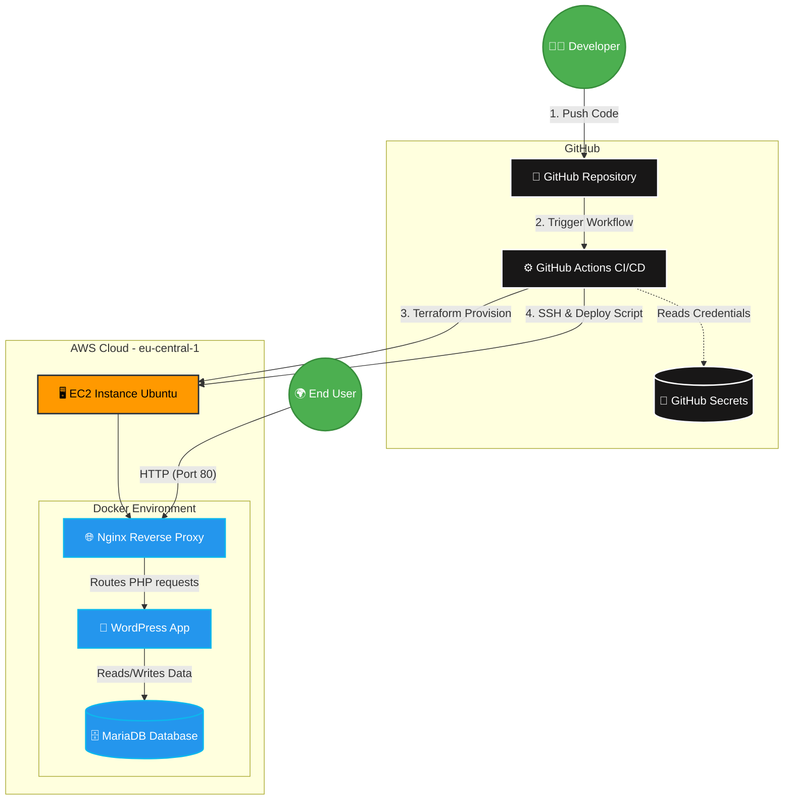

<div align="center">

# Automated CI/CD WordPress Stack on AWS EC2


<br>
</div>

# Automated CI/CD WordPress Stack on AWS EC2

Welcome to the Automated WordPress Stack project! This repository contains a complete, end-to-end CI/CD pipeline that provisions infrastructure on AWS using Terraform and deploys a fully functional WordPress website (with Nginx and MySQL) using Docker and GitHub Actions.

## Project Architecture & Tech Stack
* **Infrastructure as Code (IaC):** Terraform
* **Cloud Provider:** AWS (EC2 instance in `eu-central-1`)
* **CI/CD Pipeline:** GitHub Actions
* **Containerization:** Docker & Docker Compose
* **Web Stack:** **LEMP Stack** (WordPress, MariaDB/MySQL, Nginx (Reverse Proxy))




---

## How It Works
1. **Terraform** provisions an Ubuntu EC2 instance on AWS and configures the Security Groups (allowing ports 80, 443, and 22).
2. **GitHub Actions** triggers automatically on a push to the `main` branch.
3. The workflow SSHs into the newly created EC2 instance.
4. It dynamically generates an `.env` file from GitHub Secrets.
5. It runs a deployment script to install Docker, clean up old containers, and spin up the WordPress stack.
6. A validation script runs to ensure all containers are UP and the website returns an HTTP 200/302 status.

---

## Step-by-Step Setup Guide (For Forking/Copying)

If you want to clone this repository and run it on your own AWS account, follow these detailed steps:

### Step 1: Generate SSH Keys (Local WSL/Linux Machine)
You need a key pair to allow GitHub Actions to securely access your EC2 instance. Open your WSL or Linux terminal and run:

```bash
# Generate a new RSA key pair (without a passphrase)
ssh-keygen -t rsa -b 4096 -m PEM -f ~/.ssh/id_rsa_wordpress

# View the Public Key (You will need this for Terraform)
cat ~/.ssh/id_rsa_wordpress.pub

# View the Private Key (You will need this for GitHub Actions)
cat ~/.ssh/id_rsa_wordpress
```

⚠️ Important: When copying the keys, make sure there are no extra spaces or blank lines at the beginning or end.


### Step 2: Prepare AWS S3 for Terraform State

Terraform needs an S3 bucket to store its state securely.

    Go to your AWS Console.

    Create an S3 Bucket named muhammad-bonn-terraform-state (or update main.tf with your custom bucket name).

    Ensure the bucket is in the eu-central-1 region (or match the region in your Terraform backend config).
    

### Step 3: Configure GitHub Secrets
Go to your GitHub Repository -> **Settings** -> **Secrets and variables** -> **Actions** and add the following secrets:

| Secret Name | Where to get the value | Description |
|-------------|------------------------|-------------|
| `AWS_ACCESS_KEY_ID` | AWS IAM Console | Your AWS IAM User access key. |
| `AWS_SECRET_ACCESS_KEY`| AWS IAM Console | Your AWS IAM User secret key. |
| `MY_PUBLIC_KEY` | Terminal (`cat ~/.ssh/id_rsa_wordpress.pub`) | The public key Terraform will put on the EC2 server. |
| `EC2_SSH_PRIVATE_KEY`| Terminal (`cat ~/.ssh/id_rsa_wordpress`) | The private key GitHub Actions will use to log in. Include `BEGIN` and `END` lines. |
| `ENV_FILE` | Manually write it (See format below) | Database credentials for Docker Compose. |
| `EC2_HOST` | Leave empty for now | Will be filled after the first Terraform run. |

**Format for `ENV_FILE` Secret:**
```env
MYSQL_ROOT_PASSWORD=your_secure_root_password
MYSQL_DATABASE=wordpress_db
MYSQL_USER=wp_user
MYSQL_PASSWORD=your_secure_wp_password
WORDPRESS_DB_HOST=db
WORDPRESS_DB_USER=wp_user
WORDPRESS_DB_PASSWORD=your_secure_wp_password
WORDPRESS_DB_NAME=wordpress_db
```


### Step 4: First Push & Getting the EC2 IP

    Push your code to the main branch.

    Go to the Actions tab. The Infrastructure (Terraform) job will run and create your EC2 instance.

    The Deploy & Validate job will FAIL the very first time. This is expected because we don't know the server's IP yet!

    Open the logs for the Terraform Init & Apply step. Scroll to the bottom and find the public_ip output (e.g., 63.183.192.101).

### Step 5: Update the EC2 Host & Re-run

    Go back to Settings > Secrets.

    Update the EC2_HOST secret with the new IP address.

    Go back to the failed Action and click "Re-run failed jobs".

    The deployment will now succeed, install Docker, and start your WordPress site!

---
## Maintenance & Cleanup

If you need to tear down the infrastructure to save AWS costs, you can do it locally or via GitHub actions by running terraform destroy in the terraform directory. Always ensure you do not leave unused EC2 instances running.
